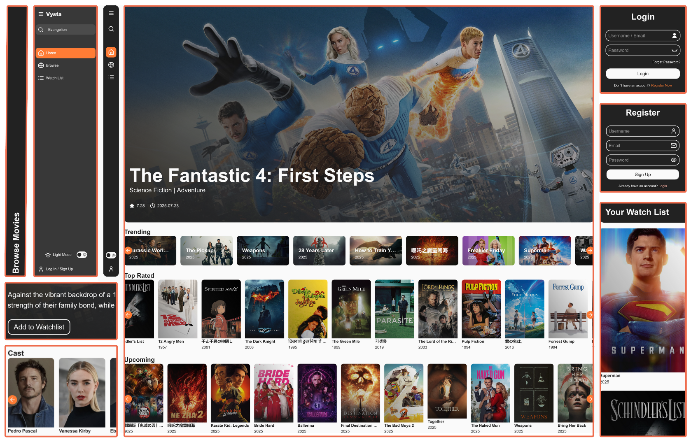
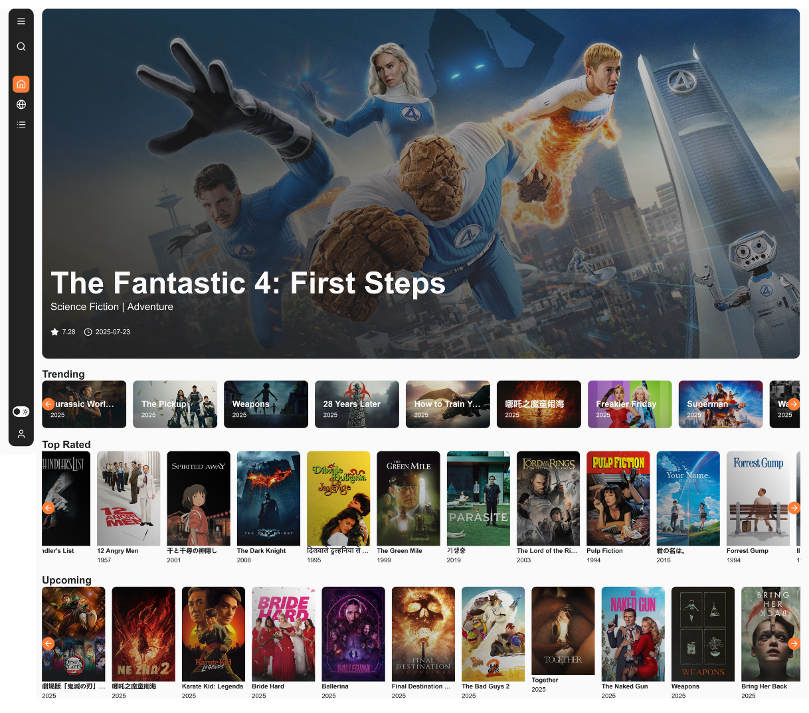
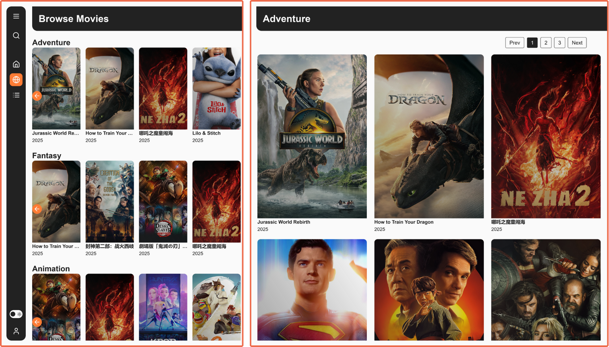
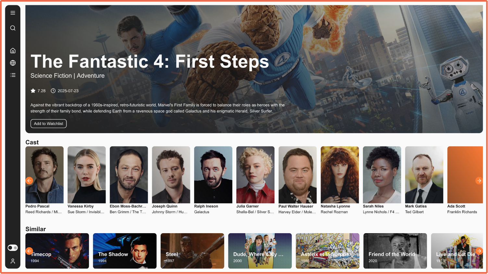
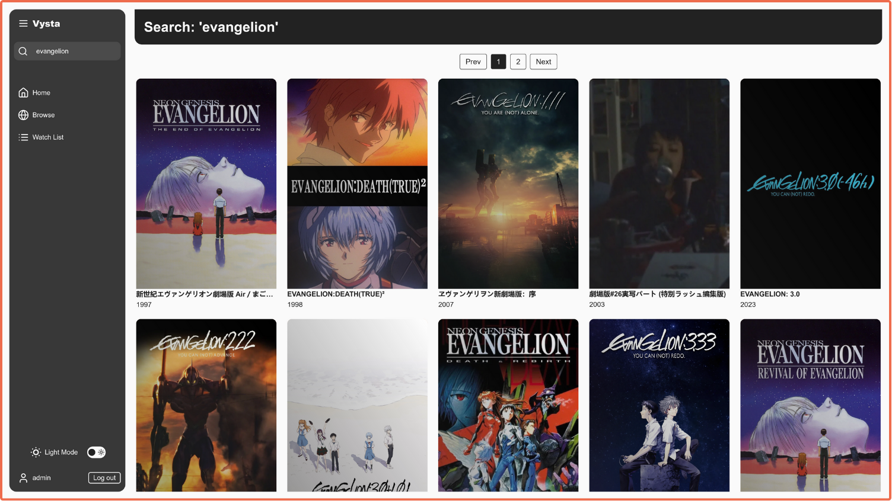
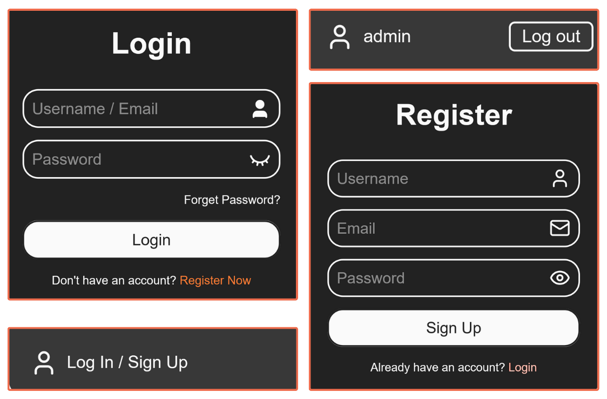
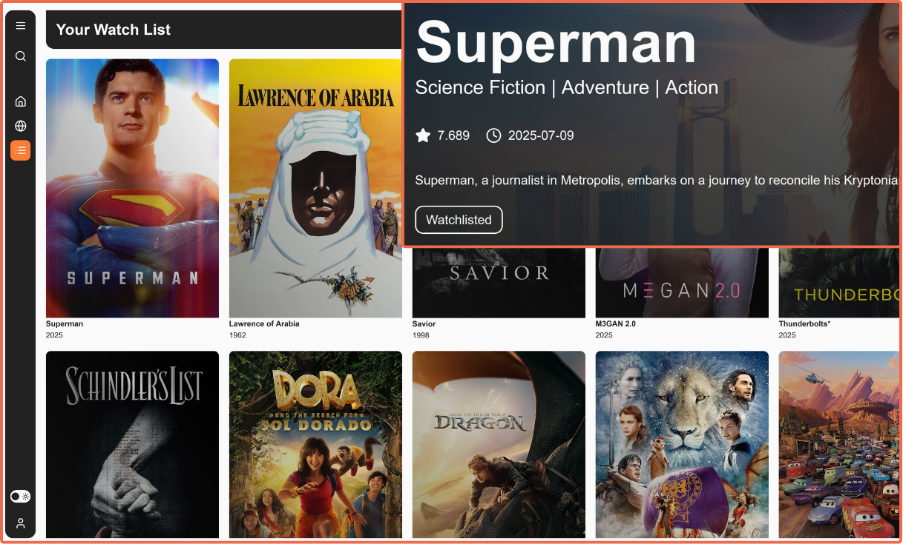

# 🍿 Vysta

**A modern movie discovery and watchlist management web application**

A React-based movie web app powered by TMDB. Users can browse and search for movies, create accounts, log in, and manage a personal watchlist. Built with React for the frontend, Node.js for the backend, and MongoDB for data storage.

---

## ✨ Features

### 🏠 **Home Page**
View trending movies, top rated films, and upcoming releases in a carousel layout.

---

### 🎬 **Browse Movies**
Browse movies by genre with pagination. Each genre has its own dedicated page for easier discovery.

---

### 📽️ **Movie Details**
View detailed movie information including plot, cast, and similar movie recommendations.

---

### 🔍 **Search Functionality**
Search for movies with real-time results.

---

### 🔐 **User Authentication**
Register and login to access personalized features like watchlists.

---

### 📚 **Watchlist**
Add movies to your personal watchlist and remove them as needed. Requires user account.

---

